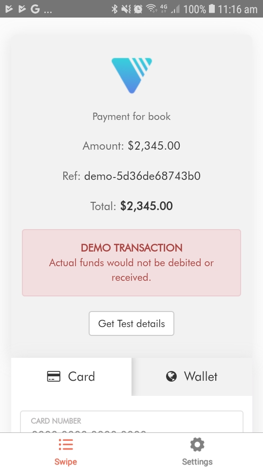
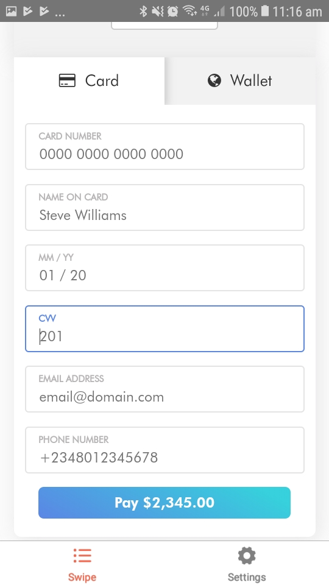
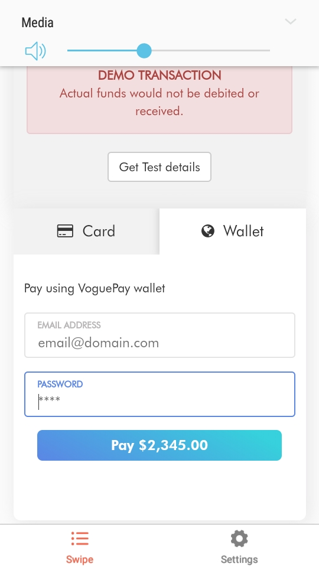

**Screenshots**

<div >



</div>

**React Native Android Library Voguepay**
This React library provides a wrapper to add VoguePay Payment to your React application.

**Get Started**
There are many ways to do this, here's the way I do it:

**Install**
*Do `npm install --save git+https://github.com/marshalsoft/react-native-voguepay.git` in your main project.

**2. Simply `import/require` it by the name library's (react-native-voguepay)`:**

    ```javascript
    import Voguepay from 'react-native-voguepay'
    ```
**5. Include as a component.**
```
   <VoguePay 
   params={{
    amount:2345,
    currency:"NGN",
    success_url:"http://www.example.com/success.php",
    fail_url:"http://www.example.com/fail.php",
    notify_url:"http://www.example.com/notify.php",
    memo:"Payment for book",
    merchant_id:"xxxx-xxxxxxx",
    merchant_ref:"xxxxxxx"
   }} 
   
   response={(d:Object)=>{ 
    alert(JSON.stringify(d))
   }} /> 
   ```
 6. Make sure the following properties ara provided
   * params:Object
   * response:function
   
 **License**
 This project is licensed under the MIT License - see the [LICENSE.md](https://github.com/marshalsoft/react-native-voguepay/blob/master/LICENSE) file for details
 
 **Keywords**
 * Javascript,github,react-native,Open Source,payments,Voguepay,payment,Gateway,react-native-voguepay
 
 **Author**
 * Name: Engr. Marshall Ekene
 * [Email](mailto://admin@marshalsoft.pro)
 * [Website](https:// www.marshalsoft.pro)
 * [Website](https:// www.marshalsoft.net)
 * [facebook](https://www.facebook.com/marshalsoft)
 * [twitter](https://twitter.com/Marshallekene)
 * [Youtube](https://www.youtube.com/c/MarshallEkene)

 **issues**
 * [report issues](https://github.com/marshalsoft/react-native-voguepay/issues)
